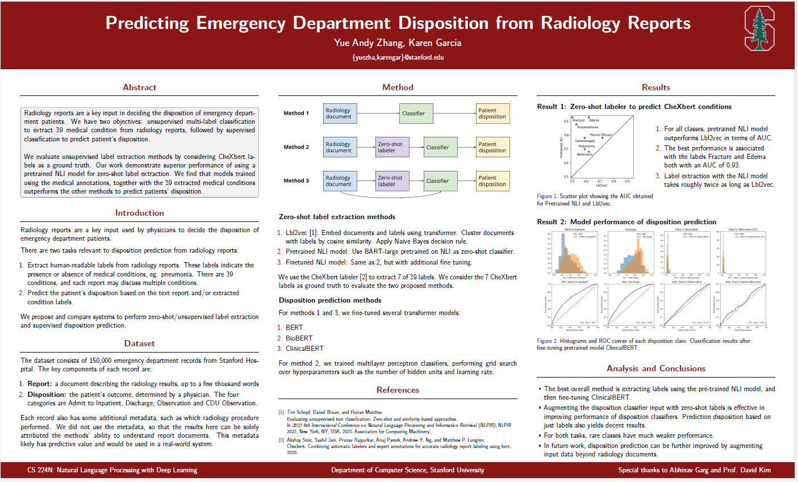

# Predicting Emergency Department Disposition. 
Code for the project "Predicting Emergency Department Disposition". CS224N Natural Language Processing with Deep Learning, Stanford University.



In this project, we propose analyzing emergency department disposition through
the lens of the radiology reports. Specifically, we have two objectives, conduct an
unsupervised multi-label classification to extract medical conditions, followed by
supervised classification to predict patients’ disposition.

Several unsupervised label extraction methods were used to obtain medical conditions
by considering CheXbert labels as a ground truth. We evaluate methods
for supervised classification of the disposition by combining the extracted medical
conditions and the radiology reports. Our work demonstrates superior performance
of using a pretrained BART-MNLI model for zero-shot label extraction. We find
that models trained using the extracted medical conditions together with medical
annotations outperforms the other methods to predict patients’ disposition.

### README 

```
mkdir ~/.aws
vim ~/.aws/config
```
Copy:
```
[profile dispo-access]
role_arn = arn:aws:iam::665713938481:role/dispo-access
source_profile=default
```
```
vim ~/.aws/credentials
```
Copy:
```
[default]
aws_access_key_id=<redacted>
aws_secret_access_key=<redacted>
```

```
# Install AWS CLI, based on https://docs.aws.amazon.com/cli/latest/userguide/getting-started-install.html
sudo apt install unzip
curl "https://awscli.amazonaws.com/awscli-exe-linux-x86_64.zip" -o "awscliv2.zip"
unzip awscliv2.zip
sudo ./aws/install
aws s3 cp s3://davidak/ED_Dispo/Shared_data/rads_dispo_lim_2023_02_23.csv ~/ --profile dispo-access
```
```
# Git repo
ssh-keygen -t ed25519 -C "yueandyzhang@gmail.com"
eval "$(ssh-agent -s)"
ssh-add ~/.ssh/id_ed25519
cat ~/.ssh/id_ed25519.pub
git clone git@github.com:karengarm/Project-CS224N-ED-Disposition.git
```
```
# Miniconda
wget https://repo.anaconda.com/miniconda/Miniconda3-py310_23.1.0-1-Linux-x86_64.sh
chmod +x Miniconda3-py310_23.1.0-1-Linux-x86_64.sh
./Miniconda3-py310_23.1.0-1-Linux-x86_64.sh
conda env create -f Project-CS224N-ED-Disposition/l2v.yml
conda activate l2v
```
```
# https://docs.aws.amazon.com/dlami/latest/devguide/setup-jupyter.html
jupyter notebook password
mkdir ~/ssl
cd ~/ssl
openssl req -x509 -nodes -days 365 -newkey rsa:2048 -keyout mykey.key -out mycert.pem
cd ~

# https://stackoverflow.com/questions/43241272/can-not-connect-to-jupyter-notebook-on-aws-ec2-instance
jupyter notebook --generate-config
vim <path printed by previous command>
# paste at line ~5: c.NotebookApp.ip = '*'

# --allow-root only necessary if current user is root
jupyter notebook --certfile=~/ssl/mycert.pem --keyfile ~/ssl/mykey.key --allow-root
```
```
# Kill to restart ssh for jupyter:
fuser 8888/tcp
fuser -k 8888/tcp
```
```
wget -O ~/chexbert.pth https://stanfordmedicine.app.box.com/shared/static/c3stck6w6dol3h36grdc97xoydzxd7w9
```
